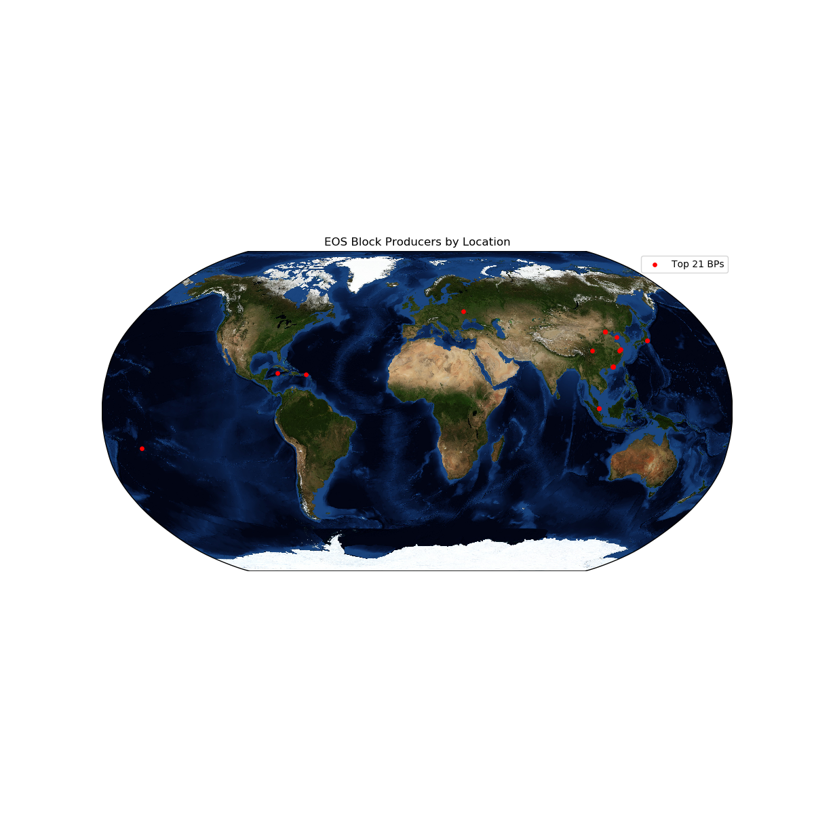
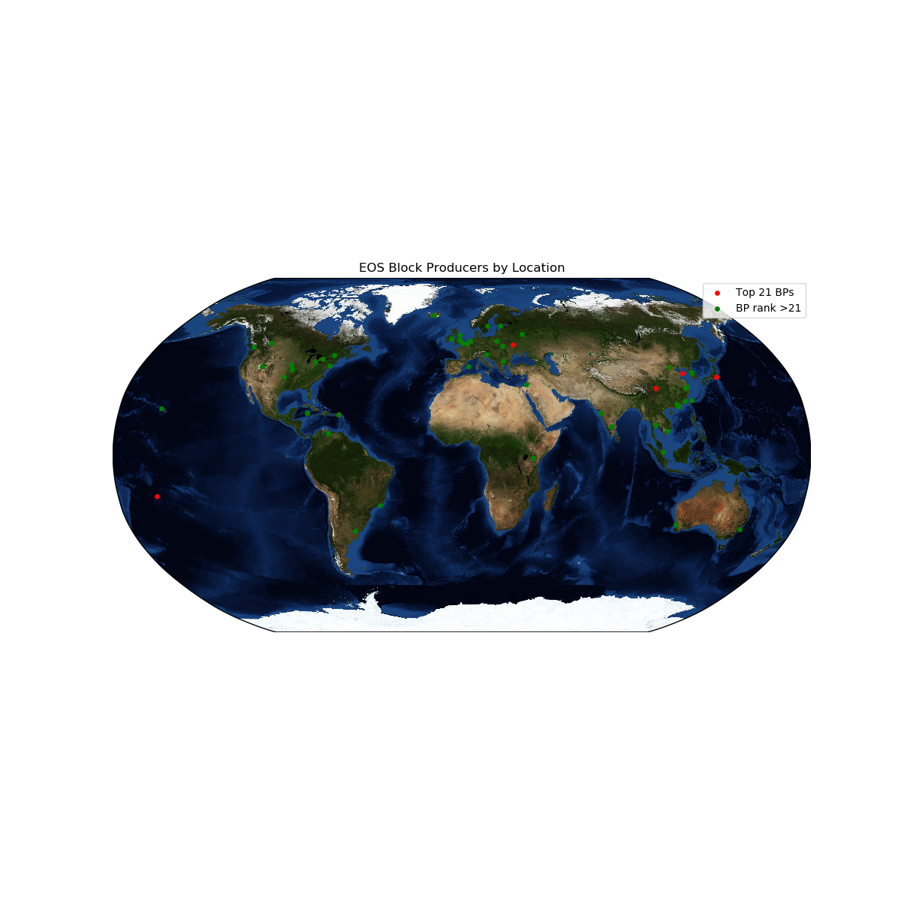

## Get the GPS locations of the top 100 block producers
The output is bp_gps_locations.json

    $ python get_bp_rank_and_gps.py

    $ bp_locations $ cat bp_gps_locations.json
    {"eoshuobipool": {"rank": 1, "lat": 40.060599, "lon": 116.32371}, "starteosiobp": {"rank": 2, "lat": 30.5911, "lon": 104.0761},

## Plot the GPS coordinates of the Top 21 BPs

    $ python plot_bp_locations_top21.py

## Plot the top 100 BPs

    $ python plot_bp_locations_top100.py

